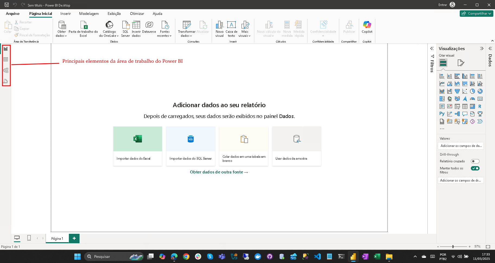
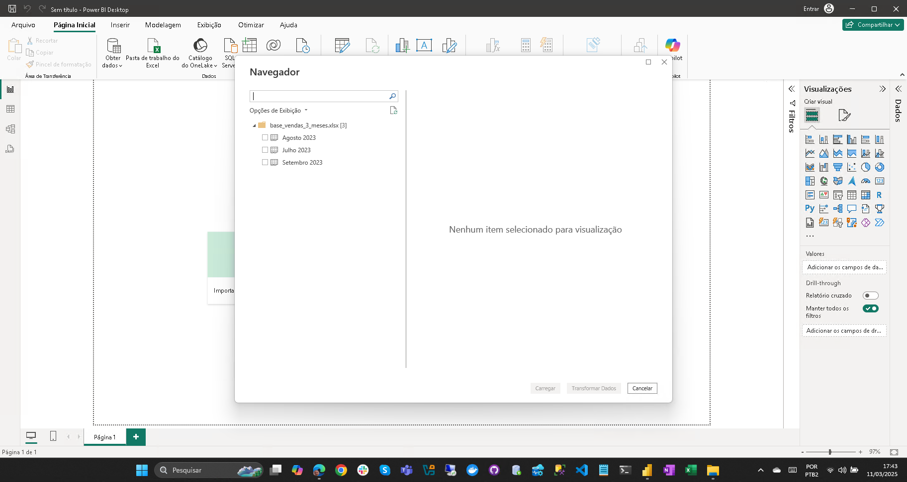
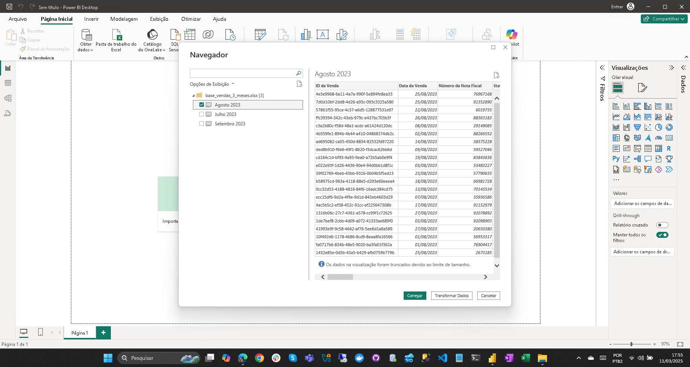
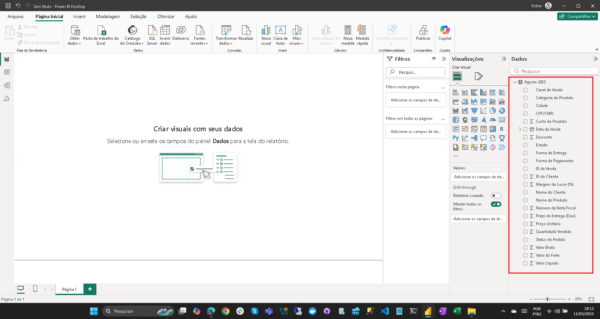

# Power Tuning - Domine o Power BI: Do Básico à Inteligência Artificial

## Módulo 1: Introdução ao Power BI

### Apontamentos

- Power BI foi criado em 2015.
- Tem origem na junção do Power Query e Power Pivot (existentes no Excel).
- Difundir a ideia do **Self Service BI** que é a capacidade dos usuários de coletar dados e criar suas próprias análises.
- Inicialmente como Power BI Desktop (ainda existe).
- Power BI Desktop = Ferramenta para criação de Relatórios.

### Fazendo o Download do Power BI Desktop

- Para baixar, procure por "power bi desktop download".
- Caso esteja utilizando o Edge, ele provavelmente irá sugerir baixar pela Microsoft Store.
- Optando pela Microsoft Store, faremos a instalação da versão **mais recente** e ele **sempre** estará atualizado, o que pode eventualmente ser um problema, caso a atualização tenha algum **Bug**.
- Rafael recomenda trabalhar com uma ou duas versões anteriores, para evitar este tipo de problema.
- [Link para página de Dowload Power BI Desktop](https://www.microsoft.com/en-us/download/details.aspx?id=58494&msockid=1633926cfc6d61c711558716fd966016)
- Recomendação para que realize a instalação no idioma **Inglês**, principalmente para quem for estudar para Certificação.
- O processo de instalação geralmente costuma ser um pouco demorado.
- Processo de instalação padrão Microsoft: **NNF (Next, Next, Finish)**.

### Abrindo o Power BI pela primeira vez

Ao abrir o Power BI pela primeira vez, você deve ter uma tela como esta:

- Na primeira conexão com o Power BI, caso apareça uma caixa para conectar a uma conta, podemos dispensar sem problemas.
- Só precisaremos utilizar uma conta, caso tenhamos a necessidade de compartilhar nossos relatórios.

### Primeiros Passos no Power BI

Na tela anterior, clicamos em Relatório em branco, para termos acesso a área de trabalho do Power BI, onde encontramos os quatro principais elementos da área de trabalho.

- Para criarmos nosso primeiro relatório de exemplo, utilizaremos o arquivo fornecido **base_vendas_3_meses.xlsx**.
- Clique em **Importar dados do Excel** e informe o caminho do local do arquivo.
- Dependendo do tamanho do arquivo, o processo pode levar alguns instantes para ser concluido.
- Depois de concluido, uma tela como esta deverá ser exibida:
  
- Observe que ela mostra o nome das três abas da planilha que acabamos de importar.
- Neste ponto eu posso escolher qualquer uma das três abas ou todas elas.
- Ao fazer a seleção, um preview dos dados é mostrado, como na imagem a seguir:
  
- Com isso temos a opção de **Carregar** ou **Transformar Dados**.
  - Carregar: Pega os dados como estão e disponibiliza para uso.
  - Transformar Dados: **ATENÇÃO NÃO ESQUECER DE COLOCAR A DEFINIÇÃO**.
- Para nosso exercício vamos escolher **Carregar**.
- Após processar, as colunas da minha tabela serão mostradas, como mostrado na imagem a seguir:
  
- Agora já posso começar a criar meu Relatório, bastando arrastar as colunas desejadas para a tela do relatório.
